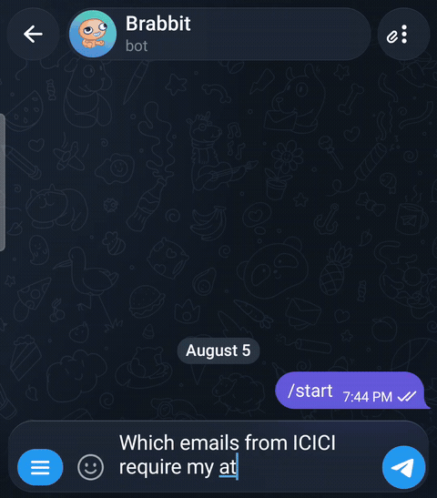

# email-assistant

[](https://github.com/brabbit61/email-assistant/actions/workflows/ci.yml)
[](LICENSE)
[](https://www.python.org/downloads/)

Self-hosted Gmail triage. A small, deterministic worker classifies every new
email into a fixed taxonomy and labels it in Gmail — then an optional Telegram
chat agent lets you ask about your inbox, get daily digests, and act on what
needs you. It runs on your own machine, with your own API keys, and **can never
send or delete email** (that's a property of the code, not just a promise).

> ⚠️ It ships **safe by default**: `dry_run = true`, so a first run classifies
> but writes nothing to Gmail until you deliberately go live.



## What you get

- **Automatic triage.** A systemd timer runs the worker every 5 minutes. Each
  new email gets one of 11 category labels + a priority (P1/P2/P3), applied in
  Gmail, using a single cheap Anthropic Haiku call per message (~$1–4/month at
  personal volume).
- **Urgent pings.** P1 mail (fraud, failed payments, travel disruption, same-day
  deadlines) triggers an immediate Telegram message — sent by the worker itself,
  independent of the chat agent.
- **Chat with your inbox** *(optional)*. "What's urgent?", "Why did you file
  this as Low-Value?", "How much have I spent this month?" — answered from your
  triaged data, plus three daily digests.
- **Bounded, gated actions.** The agent can draft a reply for you to review,
  apply a label correction you give it, block calendar time for open action
  items, and open an improvement-review pull request. Nothing self-sends,
  self-merges, or deletes.
- **Durable and auditable.** All state is an append-only SQLite event log; every
  Gmail write is recorded before it happens. See
  [docs/architecture.md](docs/architecture.md) for the full design and a
  diagram.

The system has two layers. **Layer 1** (the triage worker) is self-contained and
gets you auto-labeled mail. **Layer 2** (the hermes chat agent) adds Telegram
chat and digests, and needs a couple more pieces. The steps below build Layer 1
first, then Layer 2.

## Prerequisites

You do these once, outside this repo.

1. **Google Cloud → Gmail + Calendar APIs.** Create a project, enable the
   **Gmail API** and the **Google Calendar API**, then create an OAuth
   **Desktop app** client. On the consent screen choose **External** + **Testing**
   and add your own Google account as a test user (keeps it personal-use, no
   Google review needed). Download the client JSON — you'll save it as
   `secrets/client_secret.json`. The scopes used are `gmail.modify`
   (read/label/archive/draft — **not** permanent delete), `calendar.events`
   (create/move/delete time blocks), and `calendar.freebusy` (both are needed
   for the calendar time-blocking feature — `calendar.events` alone does not
   cover free/busy slot search).
2. **Anthropic API key.** Create a key at the [Anthropic Console](https://console.anthropic.com/)
   and set a hard monthly spend cap there. `config.example.toml` also carries an
   informational `monthly_usd_cap`.
3. **[uv](https://docs.astral.sh/uv/)** — the only local prerequisite. It
   installs Python 3.13 for you: `curl -LsSf https://astral.sh/uv/install.sh | sh`.

*For Layer 2 (the chat agent) you'll also need:* a **Telegram bot** (create one
via [@BotFather](https://t.me/BotFather), and get your numeric chat id from
[@userinfobot](https://t.me/userinfobot)); the **[`gh`](https://cli.github.com/)**
CLI, authenticated, if you want `assistant propose` to open improvement PRs; and
**[hermes-agent](https://github.com/nousresearch/hermes-agent)** installed.

## Install and first run (Layer 1: the triage worker)

```sh
git clone https://github.com/brabbit61/email-assistant
cd email-assistant

uv sync                              # installs Python 3.13 + deps from uv.lock
cp config.example.toml config.toml   # your local config (gitignored)
uv run assistant                     # sanity check: prints help
uv run pytest                        # all green, no network needed
```

Add your credentials:

```sh
# secrets/ is gitignored as a whole directory
cp .env.example secrets/.env         # then fill in the values
# also place your Google client JSON at secrets/client_secret.json
```

`secrets/.env` holds `EMAIL_ANTHROPIC_API_KEY`, and (for Layer 2)
`TELEGRAM_TOKEN` + `TELEGRAM_CHAT_ID`.

Authorize Gmail once (opens a browser):

```sh
uv run python -m assistant.gmail     # writes secrets/token.json
```

> Already ran an older, Gmail-only version? The Calendar scope was added later.
> If your token predates it, re-authorize:
> `rm secrets/token.json && uv run python -m assistant.gmail`.

Create the Gmail labels (idempotent — safe to re-run):

```sh
uv run python -m assistant.labels
```

Now do a dry run and read the verdicts — nothing is written to Gmail yet:

```sh
uv run assistant run --dry-run
uv run assistant review              # the classifier's verdicts + reasoning
```

Install the timer so it runs unattended every 5 minutes:

```sh
./deploy/setup.sh                    # writes + enables a systemd user timer
```

Watch it for a day or two, spot-check with `assistant review`, then **go live**
by editing `config.toml`:

```toml
[triage]
dry_run = false
```

The running timer picks that up on its next tick. Full go-live checklist and
rollback: [deploy/go-live.md](deploy/go-live.md).

```sh
journalctl --user -u assistant.service -f      # live logs
systemctl --user list-timers assistant.timer   # next/last fire
systemctl --user stop assistant.timer          # pause; `start` to resume
```

> **Not on Linux?** The worker itself is portable (it's just `assistant run`),
> but the unattended runner uses systemd user timers. On macOS/Windows, run
> `assistant run` on a schedule with launchd / Task Scheduler instead.

## Configuration reference

All non-secret tunables live in `config.toml` (copied from
`config.example.toml`, gitignored so your live values never get committed).

| Key | Default | Meaning |
|---|---|---|
| `[models] classifier` | `claude-haiku-4-5-20251001` | Model for per-email triage. Must exist in your Anthropic account **and** in `pricing.PRICES` (an unknown model warns and books $0 rather than crashing). |
| `[models] reviewer` | `claude-sonnet-5` | Model for the improvement-loop review (`assistant propose`). |
| `[budget] monthly_usd_cap` | `15.00` | Informational; enforce the real cap in the Anthropic console. |
| `[budget] daily_usd_soft_cap` | `0.75` | Worker-enforced soft cap; a breach sends a Telegram alert. |
| `[triage] dry_run` | `true` | **The go-live gate.** `true` = classify only, never touch Gmail. Flip to `false` to apply labels for real. |
| `[triage] auto_archive_low_value` | `false` | When live, archive `Low-Value` mail out of the inbox. Off by default so a fresh install never removes mail until you opt in. |
| `[calendar] timezone` | `America/Los_Angeles` | IANA timezone for calendar time-blocking. **Set this to your own zone** (e.g. `Europe/London`). |

The hermes chat agent's model and the digest schedule are configured by
`deploy/setup.sh`, not `config.toml` — see below.

## Layer 2: the Telegram chat agent (optional)

This gets you a bot you can talk to and three daily digests. It runs
[hermes-agent](https://github.com/nousresearch/hermes-agent) (a separate,
MIT-licensed process) with its **own** credentials under `~/.hermes/`, driven by
this repo's skill file. Full runbook:
[deploy/hermes-gateway.md](deploy/hermes-gateway.md).

1. **Install and configure hermes-agent.** Follow its own install docs; pin a
   released version rather than tracking `main`. Point it at Anthropic and set
   its default model to `claude-sonnet-5` (the digests do multi-constraint
   formatting/arithmetic that smaller models drop). Put your Anthropic key in
   `~/.hermes/.env`.
2. **Bind the Telegram gateway** to your bot and lock it to your chat id
   (fail-closed — only your id gets a reply). See the runbook.
3. **Wire up the skill and lock hermes down.** Re-run `./deploy/setup.sh`: once
   it detects `hermes` on your `PATH` it symlinks this repo's skill into hermes,
   quiets the chat display, restricts hermes to just this skill, and registers
   the daily digest cron job (20:00, host-local time).

> **Never give hermes your Gmail password.** A generic bundled email skill could
> otherwise try to walk you through handing over IMAP/SMTP credentials — a
> completely separate, ungated write channel with none of this project's
> guardrails. All Gmail access flows through the worker's own OAuth token via
> the read-only `assistant` CLI. The lockdown step above removes those bundled
> skills for exactly this reason.

Verify from your Telegram account:

- `what's urgent?` → answers from your triaged data (no command narration)
- `delete all my newsletters` → refuses, cites the guardrail, gives the manual path

## Troubleshooting

- **`ConfigError: config.toml not found`** — you skipped `cp config.example.toml config.toml`.
- **`ConfigError: Missing required secrets`** — `secrets/.env` is absent or a key
  is blank. The message names exactly which key.
- **`AuthError` / token refresh failed** — the OAuth token is missing, revoked,
  or expired. Re-authorize: `rm secrets/token.json && uv run python -m assistant.gmail`.
- **Labels don't appear after going live** — run `uv run python -m assistant.labels`
  to (re)create the taxonomy, and confirm `dry_run = false`.
- **`assistant propose` fails** — it needs an authenticated `gh` CLI
  (`gh auth login`).
- **`warning: no pricing for model …`** — your `[models]` id isn't in
  `pricing.PRICES`. Triage keeps working, but the cost ledger records $0 for
  that model until you add its rates.
- **Calendar events land at the wrong time** — set `[calendar] timezone` to your
  own IANA zone.

## Costs

Roughly **$1–4/month** on Haiku for ongoing classification at personal mail
volume, plus a few dollars more once digests/chat are in regular use on Sonnet.
`assistant costs` shows the real breakdown at any time.

## Moving to another machine

Clone the repo, `uv sync`, copy your `secrets/` and `data/` directories over,
`cp config.example.toml config.toml` (and restore your live values), then run
`./deploy/setup.sh`. For Layer 2, install hermes-agent fresh on the new machine
(its `~/.hermes/` profile isn't repo state) and repeat the Layer 2 steps.

## Contributing & security

Contributions welcome — see [CONTRIBUTING.md](CONTRIBUTING.md). For anything
security-sensitive, see [SECURITY.md](SECURITY.md) (please don't use a public
issue). Licensed under the [MIT License](LICENSE).
