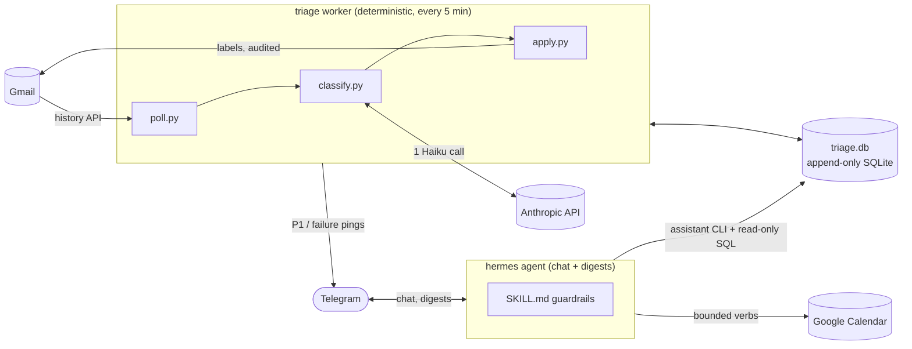

# Architecture

Two cooperating processes share one SQLite database. The seam between them is
the `assistant` CLI — plain text on stdout, exit 0/1.

1. **The triage worker** (`assistant run`, fired by a systemd user timer every
   5 minutes) is a deterministic pipeline — no agent loop. It polls Gmail's
   History API incrementally, records every new message durably, classifies it
   with a single Haiku structured-output call against a fixed taxonomy, applies
   Gmail labels with an audit-before-write contract, and sends its own Telegram
   pings for P1 mail, budget breaches, failures, and OAuth death. It is
   idempotent, checkpointed on Gmail's `historyId`, and fails loudly.

2. **The hermes agent** (a separate [hermes-agent](https://github.com/nousresearch/hermes-agent)
   process) is the conversational layer: Telegram chat and three daily digests.
   It never touches Gmail or the database schema directly — it reads through
   the CLI and read-only SQL, guided by
   [`hermes/email-assistant/SKILL.md`](../hermes/email-assistant/SKILL.md),
   and holds exactly four bounded, user-gated write powers (apply a correction,
   open an improvement draft PR, place a reply draft, manage calendar blocks it
   created).

## Module map

| Path | Responsibility |
|---|---|
| `src/assistant/cli.py` | every `assistant` subcommand; orchestrates the poll → classify → apply pass |
| `src/assistant/config.py` | loads `config.toml` + `secrets/.env` into frozen dataclasses; finds the repo root |
| `src/assistant/store.py` | SQLite schema + migrations, `current_*` views, FTS5 index, shared helpers |
| `src/assistant/gmail.py` | OAuth flow + token refresh, Gmail API client, history/list/get, MIME decode |
| `src/assistant/poll.py` | incremental history poller, checkpointing, 404 catch-up sweep, relabel detection |
| `src/assistant/classify.py` | pure `classify(Email) → Verdict` structured-output call + cost recording |
| `src/assistant/rubric.md` | taxonomy definitions + tie-breaks; read fresh on every classify call |
| `src/assistant/labels.py` | taxonomy source of truth; idempotent Gmail label reconciliation |
| `src/assistant/apply.py` | label/archive applier — writes an `intended` audit row before every Gmail call |
| `src/assistant/correct.py` | human corrections: chat-driven relabel + Gmail-side relabel detection |
| `src/assistant/draft.py` | composes and places reply-all Gmail drafts (never sends) |
| `src/assistant/calendar.py` | free-slot search + create/move/delete of marker-tagged calendar events |
| `src/assistant/backfill.py` | historical mailbox import: zero-spend estimate + checkpointed Batch API run |
| `src/assistant/propose.py` | improvement loop: reviews corrections, opens a draft PR editing rubric/skill only |
| `src/assistant/telegram.py` | worker-owned send-only pings via stdlib `urllib` |
| `src/assistant/pricing.py` | model price table for the cost ledger |

## Data model

Every table in `triage.db` is **INSERT-only** — no row is ever updated or
deleted. "Current state" is derived through the `current_classifications`,
`current_actions`, and `current_checkpoint` views (latest event per id). Full
rationale and rejected alternatives:
[ADR 0001 — append-only, event-sourced schema](adr/0001-append-only-event-sourced-schema.md).
`messages_fts` is an FTS5 index (porter-stemmed, bm25-ranked) over
sender/subject/body for ad-hoc search.

## Vocabulary

**Secret** — a credential granting access to an external service (API key,
OAuth client/token, bot token). Lives only in `secrets/`, never committed.
*Avoid:* config, env var, key (alone).

**Tunable** — a non-secret setting a human may adjust (model ids, budget caps).
Lives in `config.toml`. *Avoid:* setting, option, parameter.

**State** — data the system produces and must not lose, above all `triage.db`.
Lives in `data/`, gitignored, created at runtime. *Avoid:* cache, artifacts.

**Triage worker** — the deterministic pipeline that polls, classifies, and
labels. No agent loop. *Avoid:* bot, agent (that's the hermes layer).

**Taxonomy** — the fixed set of 11 category labels + 3 priority labels the
classifier must choose from. The system may never invent labels.
*Avoid:* categories, tags.

**Digest** — the thrice-daily Telegram summary composed by the hermes agent
from triage data. *Avoid:* report, notification (that's an urgent ping).

**Urgent ping** — an immediate Telegram message for P1 mail, sent directly by
the worker — never dependent on the agent being healthy. *Avoid:* alert, digest.

**Message** — a Gmail message the worker has seen, identified by its Gmail
message id, stored with metadata, full body, and raw Gmail JSON so downstream
reads never re-fetch from Gmail. *Avoid:* record.

**Classification** — one verdict about a Message (category, optional priority,
one-line reasoning). Append-only; the latest Classification is the current
verdict, older ones are kept. *Avoid:* label (the Gmail-side artifact), tag.

**Action** — one logical mutation to the outside world (a label add/remove,
archive, draft-create, Telegram send), recorded as immutable action events
(`intended`, then `confirmed` or `failed`). The `intended` event is written
before the external call; nothing mutates Gmail or Telegram without it.
*Avoid:* mutation, operation.

**Actor** — who initiated an Action or LLM Call: `worker`, `agent`, or
`backfill`. *Avoid:* source, origin, user.

**LLM Call** — one request to an Anthropic model by any component, recorded
with model, token counts, and USD cost. The `llm_calls` table is the cost
ledger — the single source for all spend. *Avoid:* cost row, usage.

**Run** — one poll-and-triage cycle of the worker, recorded as immutable run
events. The **checkpoint** is the Gmail `historyId` of the latest successful
run — where processing resumes. *Avoid:* cycle, job.
